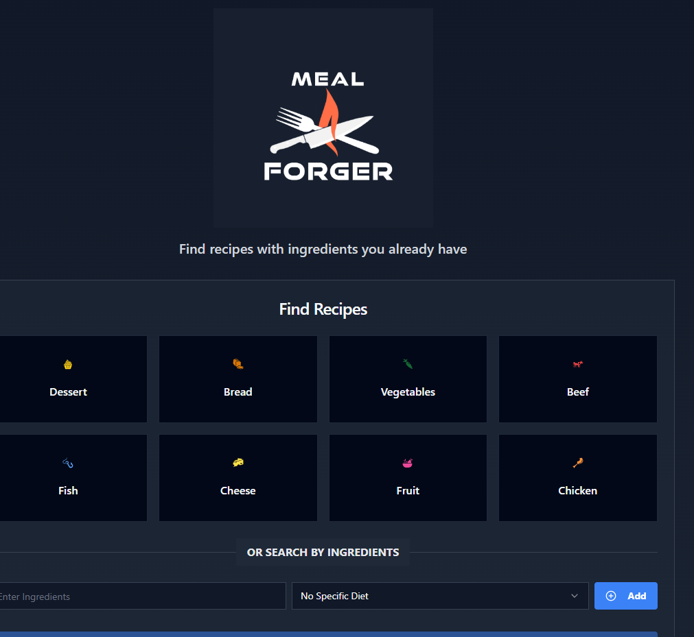

# React + Vite

Meal Forger is a web application that allows users to search for recipes based on ingredients they have on hand.

## Technologies Used
- React
- Vite
- Tailwind CSS
- TheMealDB API
- Spoonacular API

## Installation
1. Clone the repository
2. Run `npm install`
3. Run `npm run dev`

## What Each File Does
- `UserInput.jsx` - Contains the search bar and search button
- `RecipeDetails.jsx` - Generates the recipe details for the Spoonacular API
- `MealDBRecipeDetails.jsx` - Generates the recipe details for TheMealDB API
-  `main.jsx` - Contains the main components of the application and the routing
- `GetUSDAInfo.jsx` - Contains the code for the USDA API
-  `GetInstructions.jsx` - Contains extra details for the spoonacular API
-  `getGaladrielResponse.jsx` - Contains the code for the Galadriel API and verification check
-  `GoogleAnalytics.jsx` - Contains the code for Google Analytics

## Features
- Search for recipes based on ingredients
- View recipe details

## How to Use
1. Enter the ingredients you have on hand in the search bar
2. Click the "Search" button
3. View the recipes that match your search
4. Click on a recipe to view the details
5. Click the "Back" button to return to the search results

